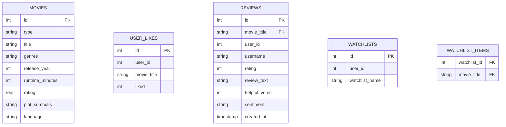

# CineMatch: Premium AI-Powered Movie Discovery Engine

CineMatch is a premium, high-performance web application built to modernize movie discovery. Powered by **Flask**, **SQLite**, and **Google Gemini AI**, CineMatch offers users a responsive, cinematic interface featuring smart multi-criteria filtering, natural language search, a conversational AI chatbot, custom watchlists, and in-depth user review sections.

---

## 🌟 Key Features

* **Smart Multi-Criteria Filtering**: Dynamic search using sliders and selectors for genres, eras (2020s, 2010s, 90s, classic, etc.), runtime, language, and custom moods.
* **NLP-Powered Semantic Search**: Describe the kind of movie you're looking for in plain language, and the query is resolved semantically.
* **Google Gemini AI Chatbot**: A contextual, responsive chatbot (`/chatbot`) designed to converse, recommend movies, and parse search criteria on the fly.
* **Bento-Grid Dashboard & Watchlists**: Group your favorite movies into custom-named playlists/watchlists, complete with dynamic layouts and lazy-loaded posters.
* **Interactive Reviews & Sentiments**: Add ratings and reviews for any title, mark reviews as helpful, and automatically classify movie sentiments.
* **Under-the-Hood Optimizations**:
  * **Asynchronous Poster Worker**: Prefetches and caches movie posters from APIs in a background thread to avoid API bottlenecks.
  * **Database Indexing**: Optimized SQLite indices reduce search and filter query latencies from ~300ms to <1ms.
  * **In-Memory Poster Cache**: Uses a secondary database table (`poster_cache`) alongside an in-memory dictionary to speed up load times.

---

## 🛠️ Technology Stack

* **Backend**: Flask (Python 3.12+)
* **Database**: SQLite3
* **AI Engine**: Google Gemini API (`google.generativeai` / `google.genai` SDKs)
* **Frontend**: HTML5, Vanilla JavaScript, Tailwind CSS (embedded/custom configurations)
* **Configuration**: `python-dotenv` for secret key and environment variable isolation

---

## 📂 Project Structure

```text
MovieApp/
├── .agents/                 # Workspace agent customizations
├── .env                     # Sensitive environment variables (Git-ignored)
├── app.py                   # Main Flask application, routes, and background workers
├── movies.db                # SQLite database storing movies, reviews, and watchlists
├── populate_db.py           # Database migration and ingestion script
├── bollywood_movies.csv     # Dataset for Indian cinema
├── netflix_titles.csv       # Dataset for Netflix releases
├── tmdb_movies.csv          # Dataset for TMDb/IMDb releases
├── static/                  # Static assets (stylesheets, images, JS)
│   ├── css/                 # Custom CSS assets
│   └── images/              # Movie covers and fallback graphics
├── templates/               # Jinja2 HTML templates
│   ├── layout.html          # Base page scaffolding and modal components
│   ├── index.html           # Homepage containing multi-filtering & grid view
│   ├── genres.html          # Genre exploration board
│   ├── eras.html            # Chronological cinematic era selection
│   ├── watchlist.html       # Watchlist and collection builder dashboard
│   └── chatbot.html         # Interactive AI conversational UI
└── README.md                # Project documentation
```

---

## 🚀 Setup & Installation

### 1. Clone the Repository
```bash
git clone https://github.com/sujoyyy/MovieApp.git
cd MovieApp
```

### 2. Configure Environment Variables
Create a `.env` file in the root directory and supply your Google Gemini API Key:
```env
GEMINI_API_KEY="YOUR_GEMINI_API_KEY_HERE"
```

### 3. Install Dependencies
Ensure you have Python 3.10+ installed. Install the necessary libraries:
```bash
pip install flask python-dotenv google-generativeai
```

### 4. Initialize & Populate the Database
Ingest the film datasets (Netflix, Bollywood, and TMDb) and construct the SQLite tables:
```bash
python populate_db.py
```
> [!NOTE]
> If the CSV datasets are missing, the populate script will automatically download them from remote repositories during run time.

### 5. Launch the Server
Start the Flask development server:
```bash
python app.py
```
Open [http://127.0.0.1:5000](http://127.0.0.1:5000) in your web browser.

---

## 📊 Database Schema & Relationships



---

## ⚡ Performance Optimizations

### SQLite Query Indexes
To guarantee high responsiveness even under large database sizes (10k+ records), CineMatch maintains the following indexes in `movies.db`:
* `idx_movies_rating` for fast top-rated list queries.
* `idx_movies_release_year` and `idx_movies_language` for immediate filter execution.
* `idx_movies_title` for direct keyword matching.

### Poster Pre-fetching
When the app launches, a lightweight background thread runs:
1. It queries the top 100+ movies needed for the landing dashboard.
2. It fetches their poster links from public APIs.
3. It updates the database `poster_cache` table and local RAM cache to minimize user-perceived load times.

---

## 🛡️ License

This project is open-source and available under the MIT License.
